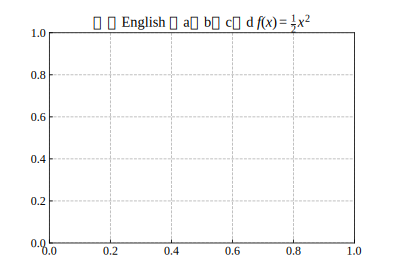

众所周知，matplotlib 默认字体不能显示中文，但论文通常要求 Times + 宋体，于是考虑这样写：

```py
plt.rcParams['font.sans-serif'] = ['Times New Roman', 'Simsun']
```

结果并没有什么卵用，还是只能 Times，于是翻阅了一下其源码，提出以下解决方案：

找到文件 `_mathtext.py`，222行附近，增加一行中文字体
```diff
class TruetypeFonts(Fonts):
    """
    A generic base class for all font setups that use Truetype fonts
    (through FT2Font).
    """
    def __init__(self, default_font_prop, mathtext_backend):
        super().__init__(default_font_prop, mathtext_backend)
        self.glyphd = {}
        self._fonts = {}

        filename = findfont(default_font_prop)
        default_font = get_font(filename)
        self._fonts['default'] = default_font
        self._fonts['regular'] = default_font
+       self._fonts['chinese'] = get_font(findfont('Simsun'))
```

530行附近，增加一条判断语句

```diff
        if not found_symbol:
            if self.cm_fallback:
                if (fontname in ('it', 'regular')
                        and isinstance(self.cm_fallback, StixFonts)):
                    fontname = 'rm'

                g = self.cm_fallback._get_glyph(fontname, font_class,
                                                sym, fontsize)
                fname = g[0].family_name
                if fname in list(BakomaFonts._fontmap.values()):
                    fname = "Computer Modern"
                _log.info("Substituting symbol %s from %s", sym, fname)
                return g

+           elif fontname != 'chinese':
+               return self._get_glyph('chinese', font_class, sym, fontsize)

            else:
                if (fontname in ('it', 'regular')
                        and isinstance(self, StixFonts)):
                    return self._get_glyph('rm', font_class, sym, fontsize)
```

这样一来会把默认字体找不到的符号用宋体代替，如果还找不到才渲染成框。



最后，这只是个临时解决方案，坐等[这条PR](https://github.com/matplotlib/matplotlib/pull/20740)合并。
