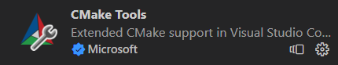
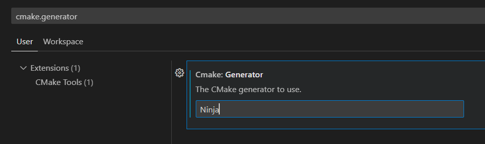

本文将介绍几个小工具，以及如何快速配置各种开发环境。

---

## 脚本执行策略
windows 默认不允许执行来源不明的 powershell 脚本，本文中提到的工具使用前要把这个干掉。
```
Set-ExecutionPolicy RemoteSigned -Scope CurrentUser
```

## 包管理器 scoop
### 对比
scoop 安装的软件是 portable 的，全部安装到自己的 `$SCOOP/apps` 目录中，不会污染系统盘和注册表（注），可以搬走。

TODO

注：某些依赖注册表增强功能的会在安装后提示可选执行的命令。

### 安装

```powershell
irm get.scoop.sh | iex
```

默认安装位置在 `~/scoop` 如果需要修改安装位置，可以设置环境变量 `SCOOP`，值为期望安装的路径。

### 使用
安装常用的软件

```powershell
scoop install aria2
scoop install 7zip git nodejs-lts python
```

注：安装 aria2 之后，安装其他程序时会默认使用 aria2 多线程下载，速度快一些。

注：默认的 `main` 仓库中只包含命令行工具，添加 `extra` 仓库可以获得许多 GUI 工具，例如 everything、obs-studio。

更新所有软件
```powershell
scoop update *
```

更新默认保留旧版本，需要手动清除
```powershell
scoop cleanup *
```

## 终端配置与美化
安装 starship 和 gsudo。前者可以提供更美观的当前目录显示、git 状态提示、项目环境和版本提示；后者提供 `sudo` 命令，需要以管理员身份运行时，不必再以管理员身份开新的终端，直接像 linux 一样使用 `sudo xxx` 即可。
```powershell
scoop install starship gsudo
```

安装新版本 PSReadLine，这两条命令需要管理员权限：
```powershell
sudo Install-Module PSReadLine -Force
sudo Update-Module PSReadLine
```

创建配置文件，执行
```powershell
if (!(Test-Path -Path $PROFILE)) {
  New-Item -ItemType File -Path $PROFILE -Force
}
```

打开配置文件
```powershell
notepad $PROFILE
```

粘贴以下内容，保存后重启终端即可
```
Set-PSReadLineOption -PredictionSource History
Set-PSReadlineKeyHandler -Key Tab -Function MenuComplete
Set-PSReadLineKeyHandler -Chord "Ctrl+RightArrow" -Function ForwardWord
Invoke-Expression (&starship init powershell)
```

解释：第 1 行开启基于历史的自动补全；第 2 行开启菜单样式的命令和参数补全，例如输入 `ff` 按 Tab 可以补全得到 `ffmpeg`，输入 `cd` 空格 Tab，可以使用方向键选择目录；第 3 行补充自动补全的功能，输入命令时按 右方向键 补全整条命令，按 Ctrl+右方向键 补全一个参数；第 4 行开启 starship 插件。此外，按 F2 可以在行内补全和历史命令列表两种模式之间切换。

效果如图：


## C++ 开发环境 vscode + clangd
在 windows 上，cmake 默认生成 Visual Studio 项目，而这个生成器不能提供 clangd 需要的 `compile_commands.json` 文件，因此我们需要换一个更好的生成器，比如 `ninja`，首先安装 `clangd` 和 `ninja`：

```powershell
scoop install clangd ninja
```

vscode 安装 cmake 插件。



然后打开 vscode 的设置，搜索 `cmake.generator`，填入 `Ninja`，注意首字母大写。



然后 `ctrl+shift+p` 打开命令面板执行 `CMake: Configure` 就可以了。如果已经 configure 过的话可能需要删除 `build` 目录再重新执行 configure。

注：看起来和网络上的教程不太一样是吧，因为网络上的教程全部过时。现在已经不需要添加 `CMAKE_EXPORT_COMPILE_COMMANDS` 选项，因为 vscode 的 cmake 插件自带了。也不需要给 clangd 设置参数，因为 clangd 会自动在当前目录和 build 子目录中查找 `compile_commands.json` 文件。

## C++ 包管理器 vcpkg
安装 vcpkg，先进入安装位置，然后执行
```powershell
git clone https://github.com/Microsoft/vcpkg
cd vcpkg
.\bootstrap-vcpkg.bat
```
把克隆下来的目录添加到环境变量 `PATH` 中。

设置环境变量 `CMAKE_TOOLCHAIN_FILE`，值为 `path/to/vcpkg/scripts/buildsystems/vcpkg.cmake`，记得改掉 `path/to`。

安装 cmake
```powershell
scoop install cmake
```

大功告成，现在就可以一键安装各种库了，例如
```powershell
vcpkg install jsoncpp
```

注：官方文档里写的使用方法是命令行添加 `-DCMAKE_TOOLCHAIN_FILE=xxxx`，这里已经设置了环境变量，即可直接执行 `cmake -B`，不必添加那一长串。

## rust 环境
```powershell
scoop install rustup-msvc
```

他会自动设置相关环境变量到 scoop 目录，然后安装 `stable-x86_64-pc-windows-msvc`。等一两分钟安装完成后就可以使用 `rust`、`cargo`、`rustup` 等命令了。

如果需要其他工具链，根据正常流程，使用 `rustup` 添加即可。

后续更新 rust 直接执行

```bash
rustup update
```

注意：不要使用 scoop 里面的 `rust` 包，这个没有源码，会导致 rust-analyzer 爆炸。

## TODO
TODO
