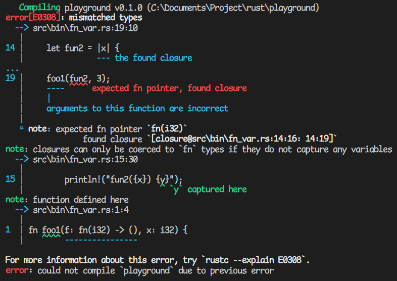

一句话：`fn` 是类型，`Fn` 是 Trait。不过对于小白，这句话好像什么都没说。

---

## 用法

`fn` 是类型，啊对，就是和 `i32`，`f64` 同一类的东西，那么用法就和他们一样咯，放在变量的后面表示变量的类型。例如以下代码中，`f` 是函数，接受一个 `i32` 类型的参数，返回 `()`。

```rust
fn foo1(f: fn(i32) -> (), x: i32) {
    f(x)
}
```

`Fn` 是 Trait，说人话大概是可以被多次调用的函数。类似的，还有 `FnMut` 和 `FnOnce`，实现了 `Fn` 的类型必定实现了 `FnMut` 和 `FnOnce`。任何一个函数都实现了 `Fn`。

注意，这里说的是**函数**，闭包的情况比较复杂，后面再说。

既然是 Trait，用法就是约束泛型参数。例如下面的代码中，`f` 的类型是 `T`，是实现了 `Fn (i32) -> ()` 的函数。

```rust
fn foo2<T: Fn(i32) -> ()>(f: T, x: i32) {
    f(x)
}

// 泛型约束也可以写到后面
fn foo3<T>(f: T, x: i32) -> () where T: Fn(i32) -> () {
    f(x)
}
```

## 区别和联系

先看下面这段程序，后面慢慢解释。

```rust
fn main() {
    fn fun1(x: i32) -> () {
        println!("fun1({x})");
    }
    let fun2 = |x| {
        println!("fun2({x})");
    };
    foo1(fun1, 1);
    foo2(fun1, 2);
    foo1(fun2, 3);
    foo2(fun2, 4);
}
```

1. `fun1` 的类型是 `fn (i32) -> ()`，完美符合，没问题
2. 任何一个函数都实现了 `Fn`，满足泛型约束，没问题
3. 没有捕获变量的闭包可以被转换成对应的函数，于是没问题
4. 编译器为这个闭包实现了 `Fn`，于是也没问题

前两个应该是没有疑问的，后两个就比较有意思了。注意这个例子中闭包是没有捕获变量的，如果有会怎样呢。



哈哈，炸了。编译器提示我们：closures can only be coerced to `fn` types if they do not capture any variables. 捕获变量的闭包是不能转换成 `fn` 类型的。

而第 4 次调用没有报错！说明这个闭包也实现了 `Fn`。那么到底是怎么回事呢，引用 [Nichts Hsu 的总结](https://nihil.cc/posts/rust_fn_traits/)：

任何一个函数都实现了 `FnOnce`, `FnMut`, `Fn`, `Copy`。

对于闭包：

- 必定实现 `FnOnce`。
- 如果闭包能仅通过可变引用访问上下文变量，则实现 `FnOnce` 和 `FnMut`。
- 如果闭包能仅通过不可变引用访问上下文变量，或者不访问上下文变量，则实现 `FnOnce`, `FnMut`, `Fn`, `Copy`。
- `move` 会导致闭包所捕获变量被移动到闭包的匿名结构体内，但是不会影响该闭包实现哪些 `Fn` Traits。
- 当闭包实现 `Fn` 时，`move` 关键字会导致闭包不总是实现 `Copy`，而是根据捕捉的变量是否实现 `Copy` 来决定自身是否实现 `Copy`。

当调用一个函数或闭包时，编译器首先寻找 `call` 方法（对应 `Fn`）来调用，如果没有，则寻找 `call_mut` 方法（对应 `FnMut`），再没有再寻找 `call_once` 方法（对应 `FnOnce`）。

参考：[Rust 中函数与闭包与 Fn Traits 探讨](https://nihil.cc/posts/rust_fn_traits/)，作者 Nichts Hsu
