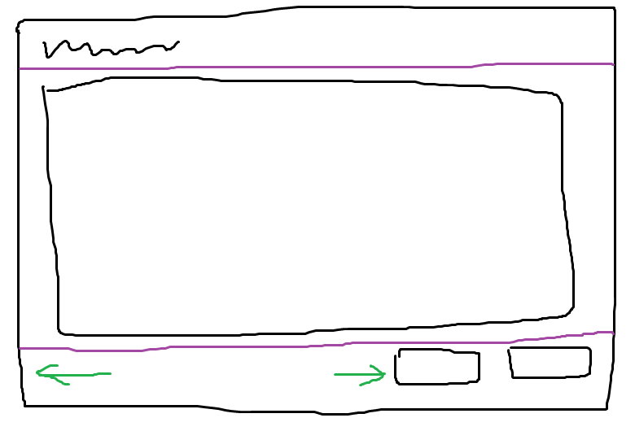

## 安装

```Bash
pip install pyside2
```


这里是基于 qt5 的 pyside2，不过对于 qt6 的 pyside6 也适用。

## 绘制界面草图

运行 `pyside2-designer`，打开界面设计工具



这里注意一些地方：

- 两个按钮大小是固定的，**先在容器外面摆**，目测好大小然后**右键固定尺寸**
- **从小到大创建**。固定大小的组件调整好之后，**先看第三行**，创建水平布局，把两个按钮塞进去，再放一个水平填充
- 创建竖直容器，把这三行内容塞进去，会发现他们的高度是平均分的，但我们只需要二行变高
- 修改竖直容器的拉伸属性，默认是 `0,0,0`，这些数值表示里面**元素所占的比例**，例如 `1,2,1` 就是 1:2:1 的意思。这里改成 `0,1,0` 就是想要的效果。
- 在窗口内容器外的任意位置右键，布局里面修改窗口的布局，例如竖直布局。
- 此时窗口内的组件就会自动适应窗口尺寸了。
- 另外记得给需要绑定信号的组件设置名字。

运行 `pyside2-uic MainWindow.ui -o MainWindow.py`

## 编写主程序

```Python
from PySide2.QtWidgets import QApplication, QMainWindow
from MainWindow import Ui_MainWindow
import sys


class MainWindow(QMainWindow):
    def __init__(self):
        super().__init__()
        self.ui = Ui_MainWindow()
        self.ui.setupUi(self)
        
        # connect signals
        # self.ui.button_ok.clicked.connect(self.foo)


if __name__ == '__main__':
    app = QApplication(sys.argv)
    mainWindow = MainWindow()
    mainWindow.show()
    sys.exit(app.exec_())
```


## qt 联动 matplotlib

修改和对接方法：

- 先把绘图程序改成用 `fig` 和 `ax` 的
- 在设计工具里面给要放图的地方预留位置，注意拉伸参数设置，这是为了最小化代码量
- 当然你要是能全用代码创建界面那当我上一条没说
- 创建画布并保存起来
- `fig = self.canvas.figure`
- `ax = fig.subplots()`
- 后面就是把绘图程序抄过来了
- 注意绘图不要占用太多时间，会卡主线程

```Python
from matplotlib.figure import Figure
from matplotlib.backends.backend_qt5agg import FigureCanvas

class MainWindow(QMainWindow):
    def __init__(self):
        super().__init__()
        self.ui = Ui_MainWindow()
        self.ui.setupUi(self)

        # setup
        self.canvas = FigureCanvas(Figure(figsize=(6, 6)))
        self.axes = self.canvas.figure.subplots()
        self.ui.container.addWidget(self.canvas)

```
